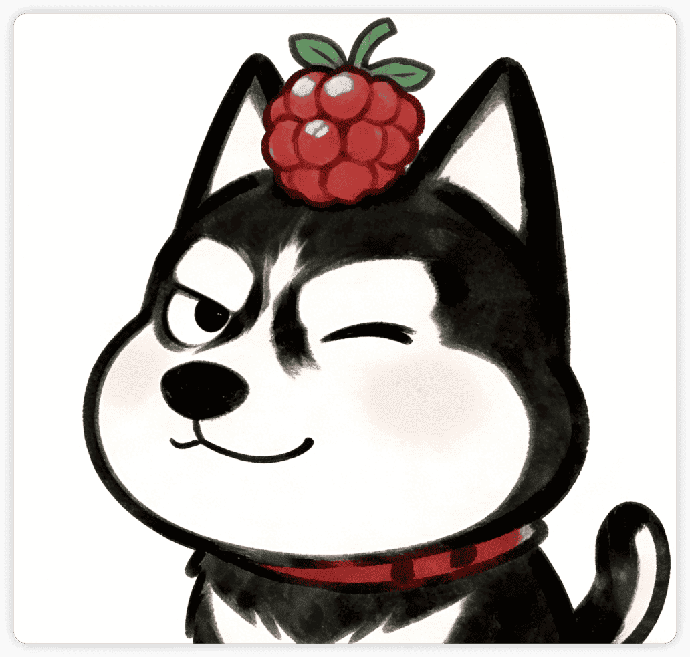
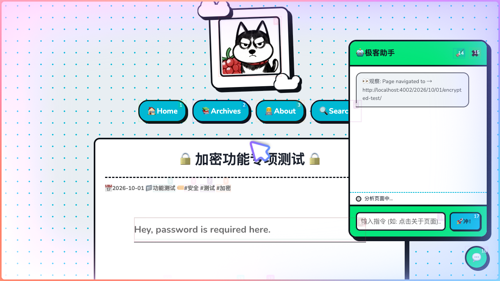
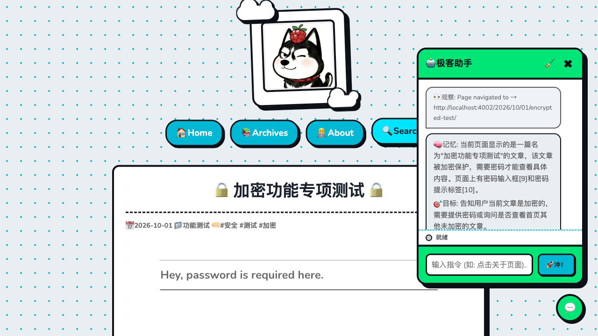
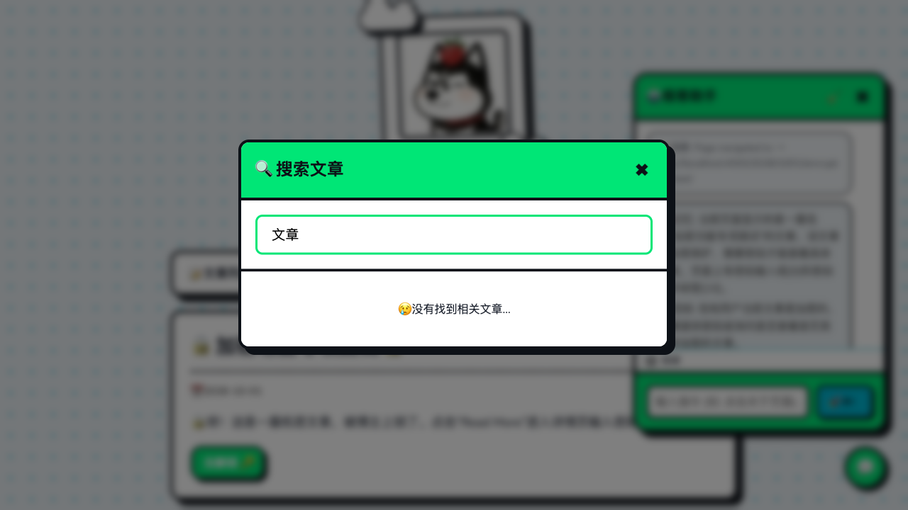
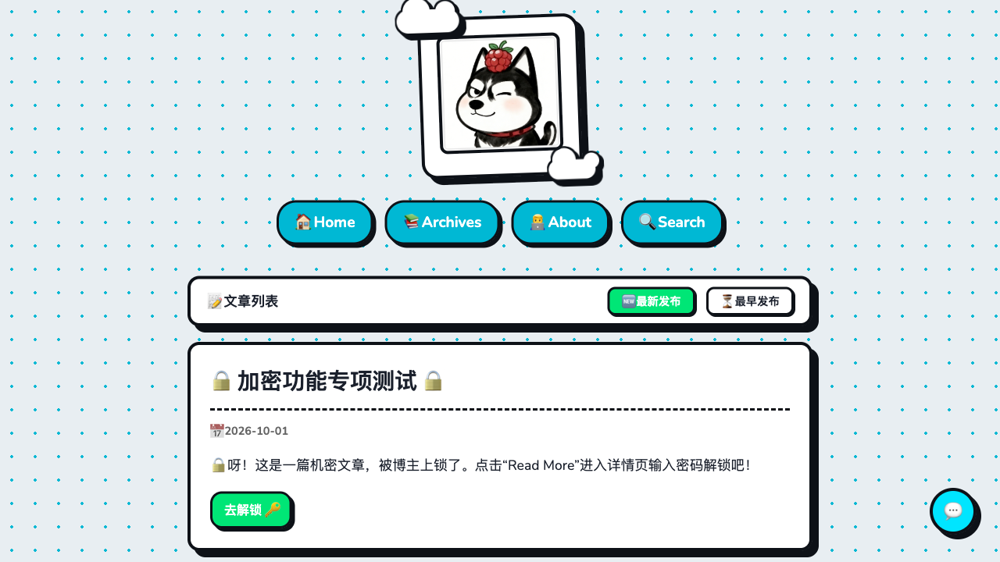
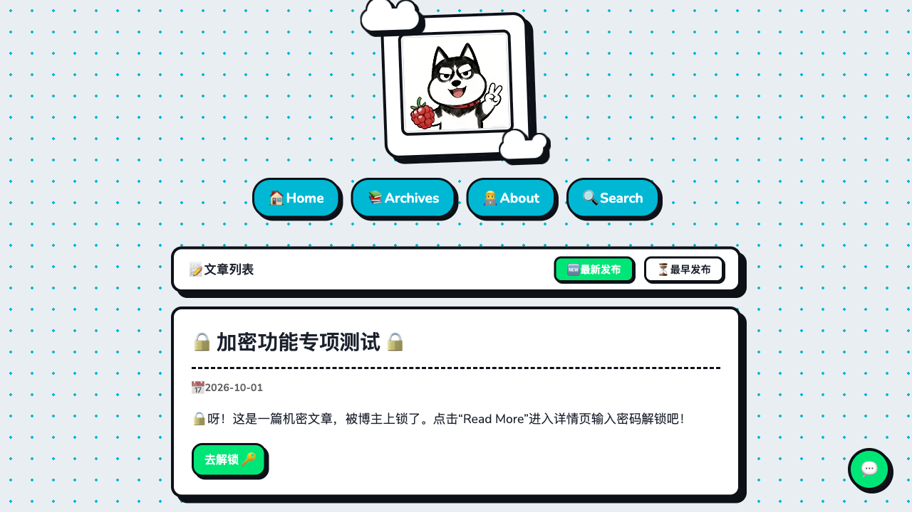
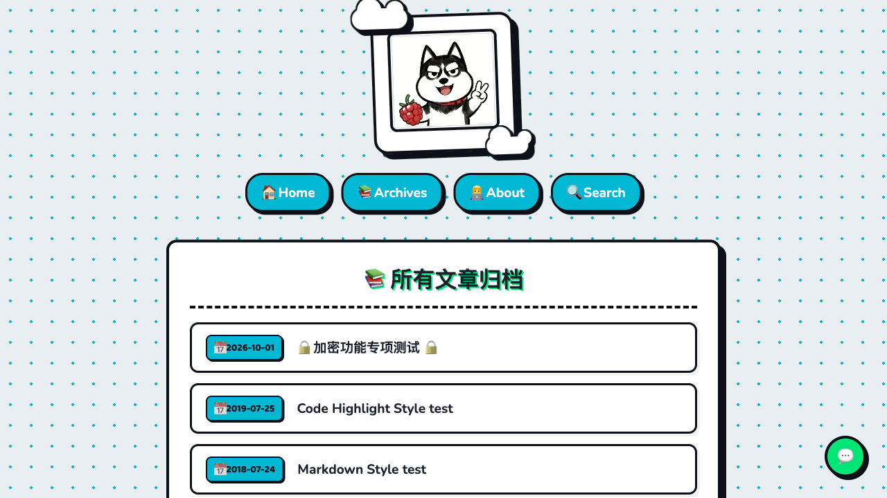

# Hexo Theme Cartoon 🎈



`hexo-theme-cartoon` 是一个卡通风格的 Hexo 主题。
它摒弃了传统博客常见的扁平化与极简设计，采用了粗边框、高饱和度的色彩和卡片阴影，旨在为你提供一个类似漫画或独立游戏风格的博客外观。

此外，本主题集成了基于大语言模型（LLM）的网页助手（Page Agent），以增强用户的交互体验。

## ✨ 核心特色功能

### 🎨 卡通与极客 UI 风格
- **硬边阴影与粗边框**：所有文章卡片、按钮、输入框均采用 `box-shadow: 4px 4px 0px` 和粗边框设计，悬停时带有物理弹跳动效。
- **动态云朵背景**：基于 CSS 绘制的动态漂浮云朵，搭配卡通风格的壁纸。
- **圆润的字体排版**：默认使用 `Baloo 2` 和 `Nunito` 字体，与整体圆润的卡片风格保持一致。
- **代码高亮适配**：定制了 Hexo 默认的 Highlight.js（Atom One Dark 配色），代码块同样包裹在卡通卡片中。

### 🤖 智能网页助手 (Page Agent)
本主题集成了基于阿里开源的 `page-agent` 技术的网页助手。
- 它可以读取当前页面的 DOM 结构并理解内容。
- 能够根据用户指令执行翻页、点击链接等操作。
- 支持多轮连贯对话（Interactive Mode），在执行需要用户确认的任务时会暂停并等待输入。

**Agent 执行中的遮罩状态：**


**Agent 任务完成后的对话历史记录：**


### 🚀 前端交互体验
- **全站搜索**：基于 `hexo-generator-searchdb`，点击导航栏搜索按钮会弹出磨砂质感的搜索框，支持关键词高亮。

- **平滑的动画过渡**：页面元素的加载和悬停均配备了适度的 CSS 动画。

### 🔒 支持文章密码加密
- 兼容 `hexo-blog-encrypt` 插件。
- 为加密文章提供了锁头（🔒）图标和专属的密码输入 UI 提示。

- 解密后的复杂 Markdown 元素（代码块、列表、引用）能正常渲染。

---

## 📦 安装与使用

本主题支持两种安装方式：NPM 安装（推荐）或 Git Clone。

### 方式一：NPM 安装 (推荐)
如果作者已将本主题发布至 NPM 仓库，你可以在你的 Hexo 博客根目录下直接运行：
```bash
npm install hexo-theme-cartoon
```

### 方式二：Git Clone 安装
在你的 Hexo 博客根目录下执行：
```bash
git clone https://github.com/你的用户名/hexo-theme-cartoon.git themes/cartoon
```

### 启用主题
无论使用哪种安装方式，安装完成后，修改 Hexo **根目录**的 `_config.yml`：
```yaml
theme: cartoon
```

### 安装必要的依赖插件
*(注意：如果你使用的是 NPM 方式安装主题，大部分依赖会被自动安装，但仍建议检查)*
本主题依赖以下 Hexo 插件以实现完整功能：
```bash
npm install hexo-renderer-ejs hexo-renderer-stylus hexo-renderer-marked hexo-generator-searchdb hexo-blog-encrypt hexo-generator-sitemap --save
```

---

## ⚙️ 主题配置指南

主题的所有配置项都在 `themes/cartoon/_config.yml` 中。

### 导航栏设置
你可以自由添加 Emoji 来装饰你的菜单：
```yaml
menu:
  🏠 Home: /
  📚 Archives: /archives
  👨‍💻 About: /about/
```

### 个性化配色 (Colors)
随时修改这些 CSS 变量，打造属于你的专属色系：
```yaml
primary_color: "#FF6B6B"     # 主色调（如红色）
secondary_color: "#4ECDC4"   # 辅色调（如青色）
background_color: "#FFF3E0"  # 页面底色
text_color: "#2C3E50"        # 文本颜色
```

### 智能助手 (Page Agent) 配置
为了防止 API Key 在纯静态前端泄露，**强烈建议使用 Cloudflare Worker 等 Serverless 服务进行代理中转**。
```yaml
page_agent:
  enable: true
  # 请勿在此处填入真实的 Key，填入一个占位符即可
  api_key: "dummy_key_not_needed_for_proxy" 
  # 填入你部署好的 Cloudflare Worker 代理地址
  base_url: "https://your-proxy.workers.dev/v1" 
  model: "minimax-m2.7" 
  language: "zh-CN"
```

### 开启全站搜索
请确保在 Hexo **根目录**的 `_config.yml` 中添加以下配置以生成搜索索引：
```yaml
search:
  path: search.json
  field: post
  content: true
```

---

## 📝 编写加密文章
本主题完美支持单篇文章加密。只需在文章的 Front-matter 中添加 `password` 字段即可：

```yaml
---
title: 我的私密日记
date: 2026-10-01
password: hello
---
这是被加密的内容，只有输入 hello 才能看到！
```

---

## 📸 效果截图

### 首页与动态排序卡片


### 卡通风格的归档时间线


---

## 📄 License
MIT License. Feel free to use and modify! 
Designed with ❤️ for Geek & Cartoon lovers.

---

> **🤖 AI 生成声明 (AI-Generated Disclaimer)**
> 
> 本项目的**所有源代码（HTML/EJS/CSS/JS）、说明文档以及主题中包含的所有配图与壁纸资源，均由人工智能（AI）全自动生成与编写**。这是一个完全由人类提供创意方向，AI 独立完成设计与编码交付的开源探索实验。